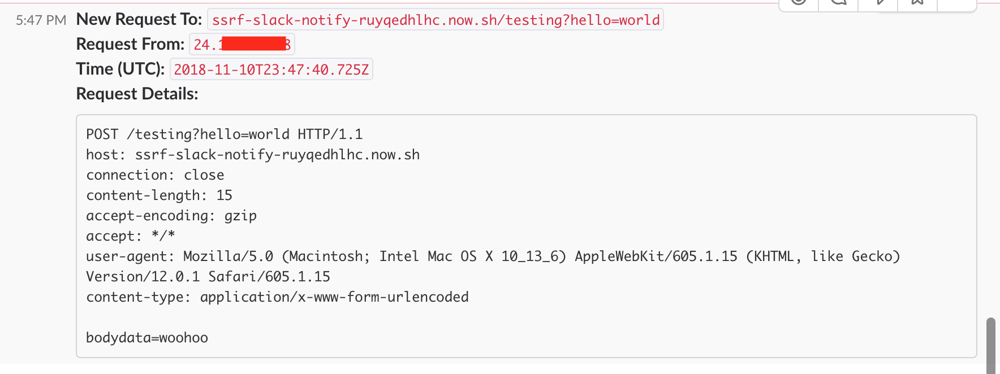

# SSRF Slack Notifier
This example immediately dumps any HTTP request it gets to a Slack webhook. This is very useful for when testing for SSRF or blind XSS, as you will be immediately notified if any server makes a request to this URL.

The function listens for any incoming request. When one in received, it constructs a friendly Slack message that details the requesting IP address, a timestamp, and a completed dump of the incoming request. Similar to the `req_dump` example, I ignore headers that Cloudflare and Zeit add, but if you want those dumped they can be toggled with the environment variable `ALL_HEADERS`.

To customize the Slack message, modify the `renderSlackMessage` function in `server.js`.

The function requires the environment variable `SLACK_WEBHOOK`.

## Deployment
Since it is possible to view public `now.sh` deployment source code and environment variables, it is advisable to keep your Slack WEBHOOK_URL in a [now.sh secret](https://zeit.co/docs/v1/features/env-and-secrets)

```
$ now secret add slack-webhook-ssrf https://hooks.slack.com/services/YOUR_WEBHOOK_HERE
```

And deploy the function with the secret as the environment variables:

```
$ now -e SLACK_WEBHOOK=@slack-webhook-ssrf --public
```

## Usage
When deployed, an incoming HTTP request will be dumped to Slack, including POST message bodies:

```
$ curl -H "User-Agent: Mozilla/5.0 (Macintosh; Intel Mac OS X 10_13_6) AppleWebKit/605.1.15 (KHTML, like Gecko) Version/12.0.1 Safari/605.1.15" -X POST --data "bodydata=woohoo" http://ssrf-slack-notify-ruyqedhlhc.now.sh/testing\?hello\=world
```


